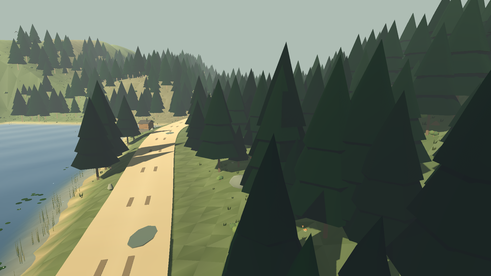
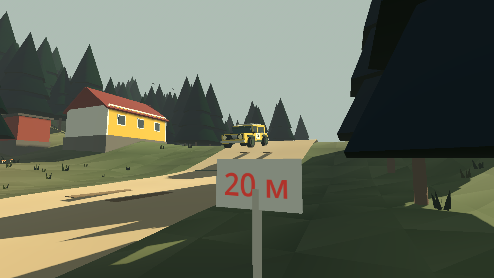
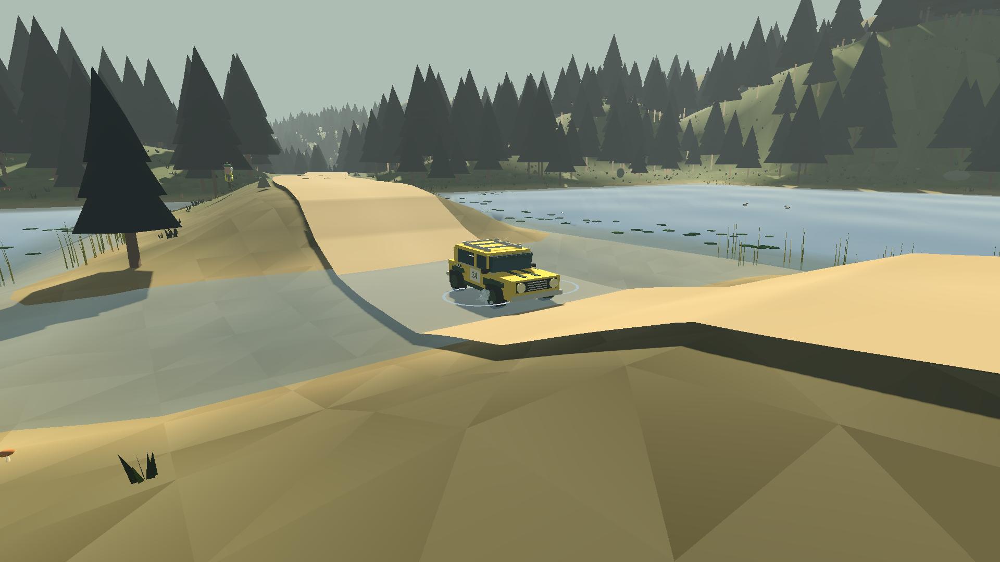
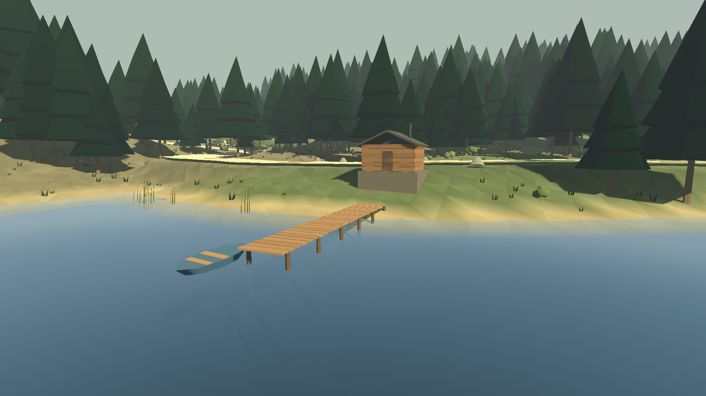
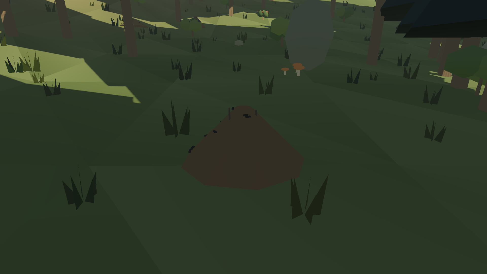

# Финский лес

Пятый СУ, `content_id: 4`, SKU `stage_05`. Быстрый гравийный спецучасток через
финский сосновый лес и вдоль озёр. Характер трассы вдохновлён классикой Rally
Finland — Оунинпохьей: прыжки на гребнях, длинные скоростные дуги, озёра у
самой дороги. Геометрия оригинальная и не копирует реальную трассу.
Масштаб такой же, как у остальных СУ: 840 маршрутных единиц.

| Станции | Участок |
| --- | --- |
| 0–170 | Разгон по широким скоростным дугам, первый гребень (~104) |
| 176 | «Жёлтый дом»: главный прыжок у жёлтого хутора, таблички 20–60 м отмечают дальность |
| 230–290 | Серия гребней перед спуском к озеру |
| 296–432 | Первое озеро слева: острова, тростник, кувшинки, сауна с мостками и лодкой |
| 438–518 | Лесная шикана: узкая дорога, связка коротких поворотов |
| 548–652 | Перешеек между двумя озёрами; на станции 600 дорога пересекает протоку бродом (~0,4 м) |
| 662–684 | Двойной гребень на выходе с перешейка |
| 705–822 | Третье озеро справа, остров, финальные гребни |

## Вода

`game/scripts/water.gd` — единая поверхность озёр. Уровень каждого озера точный и
детерминированный, рельеф дна (`finnish_forest.gd`) одинаков на всех клиентах.
Небольшие волны рассчитываются одной формулой в шейдере
(`shaders/lake_waves.gdshaderinc`) и на CPU, поэтому лодка и утки качаются на
видимой поверхности.

- **Плавучесть.** `vehicle_motion.suspension` добавляет подъёмную силу по доле
  погружённого кузова. На глубине машина отрывается от дна и дрейфует без сцепления.
- **Затопление.** Пока кузов в воде, салон набирает воду, плавучесть падает, и машина
  тонет. У игрока при затоплении снижается состояние машины. Если не выехать или не
  выйти (F), выезд заканчивается: «Легковушка утонула в финском озере».
- **Сопротивление.** Скорость гасится квадратично от погружения и скорости.
  Мелкий брод проходится на ходу, с брызгами.
- **Люди.** На мелководье ходьба замедляется. Глубже 1,2 м персонаж плывёт на
  поверхности, вдвое медленнее, прыгать нельзя. По мосткам можно ходить.
- **Брызги и круги.** Машины, экипажи в броде, пловцы, рыба и гравий из-под колёс
  поднимают капли и оставляют расходящиеся круги. Гравий в озере тонет.
- Стол, стулья и прочий лагерь нельзя поставить в воду. Судьи, зрители и NPC-лагеря
  стоят только на сухой земле.

## Живой лес

Сосны, трава, камни и валуны, кусты с ягодами, грибы (включая мухоморы и
поганки), муравейники — общая лесная генерация, которая на этом СУ обходит озёра,
хутор и сауну. Ягоды и грибы собираются, как в «Лесном перевале».
`game/scripts/forest_life.gd` добавляет то, что делает лес живым:

- ветер качает кроны и траву (`shaders/forest_wind.gdshader`), упавшие деревья не качаются;
- тростник по берегам колышется, кувшинки с цветами качаются на волнах;
- утки плавают семьями и уплывают от людей;
- над лесом кружат птицы, над тростником летают стрекозы;
- из озера выпрыгивает рыба;
- по муравейникам рядом с игроком бегают муравьи.

Эти детали локальные и не синхронизируются. Игровое состояние (деревья, камни,
ягоды, грибы) детерминировано и общее для всей комнаты.

## Проверка

`game/tests/test_finnish_forest.gd` (входит в `npm test`, группа `world`) проверяет:

- гребни и прыжок у жёлтого дома, шикану, озёра вдоль дороги и перешеек, брод,
  сухое полотно вне брода;
- лес и детали на суше, ягоды и грибы;
- плавучесть, затопление и погружение машины, сопротивление воды, брызги;
- плавание и мостки, гравий в воде;
- запрет ставить мебель в воду, сухие лагеря NPC и посты судей;
- гибель машины в озере в реальной игре.

Сервер сохраняет номер СУ в комнате (`tests/room-core.test.mjs`).
VK-доступ проверяют `tests/store.test.mjs` и `game/tests/test_vk_catalog_matrix.gd`.

Превью меню и скриншоты (`docs/screenshots/finnish-forest-*.webp`) снимает
`game/tools/export_finnish_forest_screenshots.gd`:

```sh
xvfb-run -a godot --path game --rendering-method gl_compatibility --script res://tools/export_finnish_forest_screenshots.gd
```






