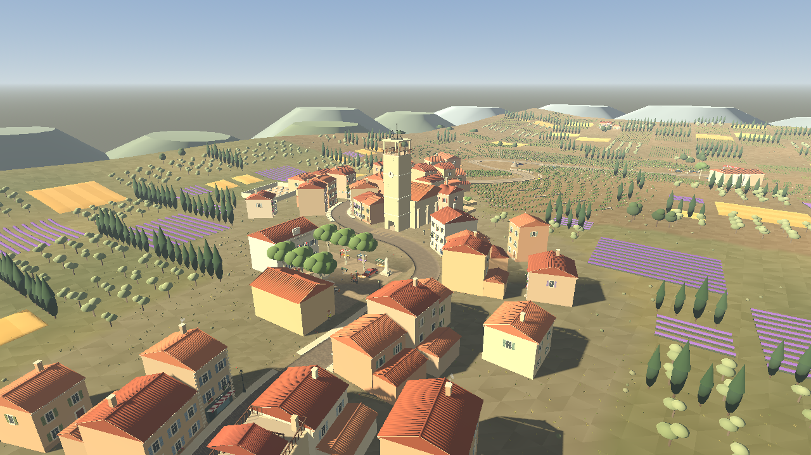
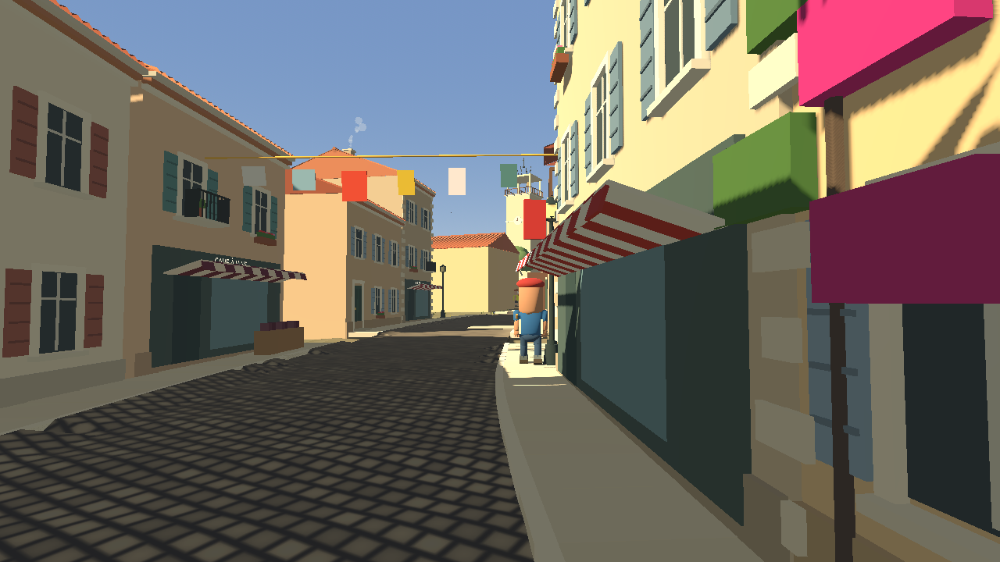
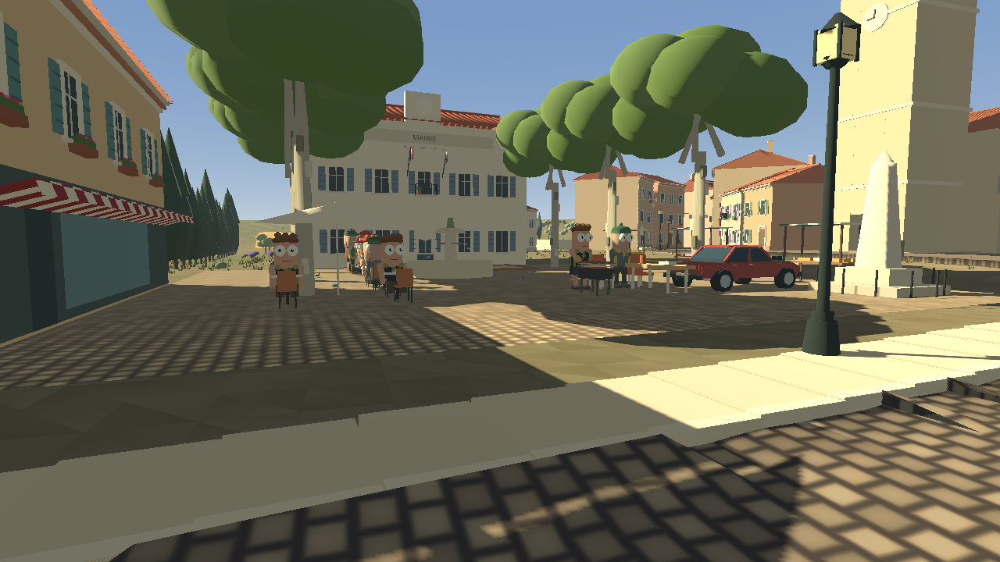
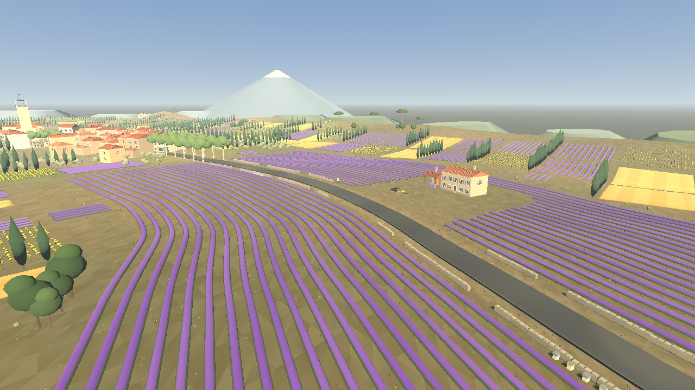
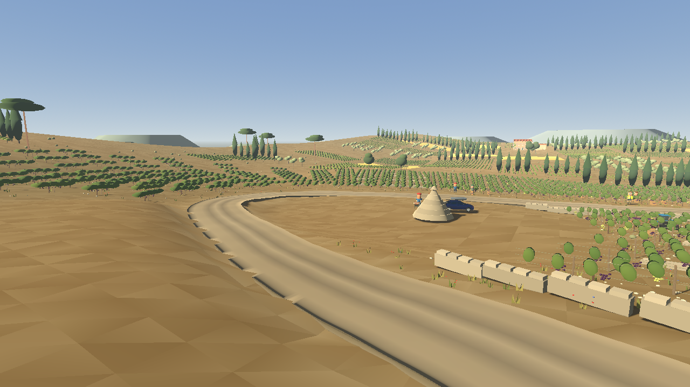
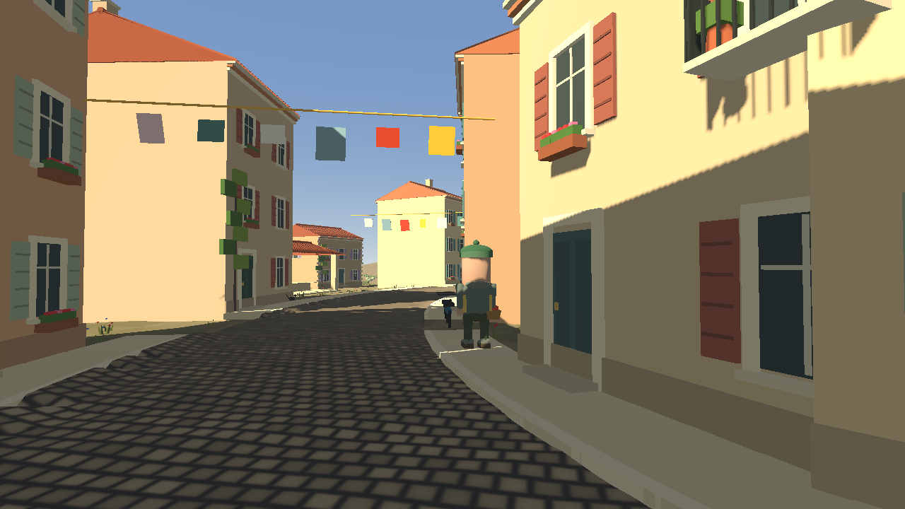

# Виноградники · провансальская деревня

Третий СУ, `variant 2`. Спецучасток через провансальскую деревню на холме между
лавандовым плато и виноградными террасами. Длина такая же, как у остальных СУ,
840 маршрутных единиц. Станция — длина дуги в метрах.

| Станции | Участок | Покрытие |
| --- | --- | --- |
| 0–250 | **Лавандовое плато**: быстрые дуги, сухие каменные стены, ульи, мас с лавандовой дистиллерией | асфальт |
| 250–290 | **Аллея платанов** с белыми светоотражающими поясами и оливковые рощи; табличка деревни | асфальт |
| 290–382 | **Гранд-Рю**: S-связка между сплошными рядами каменных домов, лавки, тротуары с бордюром | брусчатка |
| 382–446 | **Площадь**: резкий левый вокруг площади с платанами, фонтаном, площадкой для петанка, кафе и мэрией. Напротив церковь с колокольней | брусчатка |
| 446–528 | **Церковный переулок**: узкий спуск мимо лавуара и кладбища с кипарисами, выезд через ворота | брусчатка |
| 528–700 | **Террасы**: гравийный спуск по виноградникам, домен, шпилька (640–692), бори среди олив | гравий |
| 700–840 | **Долина**: быстрый финиш через виноградники во время сбора урожая, финиш у винного кооператива | гравий |

Места зрителей: у дистиллерии (135), на площади, над шпилькой (662) и в долине (792).



## Деревня

- Сплошные ряды двух- и трёхэтажных домов из светлого камня и штукатурки,
  черепица «канал», génoise под карнизом, ставни разных цветов, ящики с цветами,
  балконы, плющ и бугенвиллея. За фасадами улицы — второй ряд домов с садами и
  инжиром, поэтому деревня читается как квартал, а не как одна улица.
- Лавки: BOULANGERIE, TABAC · PRESSE, PHARMACIE, ÉPICERIE, SAVONNERIE,
  CAVE À VINS и другие с полосатыми маркизами и товаром у входа.
- Площадь: платаны, фонтан, памятник, скамейки, рыночные лотки, кафе
  CAFÉ DE LA PLACE с террасой, MAIRIE с триколором.
- Церковь с колокольней сохранила интерьер, лестницу, смотровую площадку и
  колокол. Дом с террасой на крыше стоит на Гранд-Рю.
- Чугунные фонари у фасадов можно сбить; падение синхронизируется в комнате.





## Окрестности

Придорожные лаванда и виноградники сменяются лоскутным одеялом полей
(`village_farmland.gd`) на всей свободной земле карты: лавандовые поля, спелая
пшеница, подсолнухи, виноградники, оливковые рощи и залежь с гарригой. Часть
полей защищена кипарисовыми лесополосами от мистраля, на дальних участках стоят
хутора-масы с амбарами. На горизонте — гряды холмов и вершина Ванту.

Виноград у дороги и инжир в садах собираются через F и считаются ягодами.





## Жизнь деревни

`village_life.gd` — местные детали, как `forest_life.gd` у «Финского леса»:
жители гуляют по тротуарам (с багетом, корзиной, в берете), останавливаются и
машут при проезде раллийной машины; завсегдатаи кафе пьют кофе; старики играют
в петанк; голуби кормятся у фонтана и взлетают от людей; ласточки, кошки на
подоконниках, бельё на верёвках над переулками, дым из труб, струи фонтана,
пчёлы над лавандой у ульев, сборщики винограда и трактор с прицепом в долине.
В звуке — короткие хоры цикад. Эти детали не синхронизируются; игровое
состояние (коллизии, фонари, колокол, урожай) общее для всей комнаты.



## Архитектура

СУ устроен как «Красный каньон» и «Финский лес»: `stage.gd` спрашивает модуль
СУ о маршруте, земле, сцеплении, ширине и темпе, а затем вызывает `build()`.

| Файл | Ответственность |
| --- | --- |
| `village_layout.gd` | Данные: контрольные точки маршрута, участки дороги, места объектов в координатах «станция · смещение» |
| `village_stage.gd` | Геометрия: маршрут (Catmull-Rom по длине дуги), рельеф, ровные площадки, бордюры, сцепление, цвета и материал дороги |
| `village_architecture.gd` | Дома, лавки, площадь, церковь, мэрия, кафе, лавуар, кладбище, фермы |
| `village_landscape.gd` | Придорожные посадки, деревья, стены, трава и цветы, горизонт |
| `village_farmland.gd` | Лоскутные поля, лесополосы и хутора на остальной карте |
| `village_life.gd` | Местная анимированная жизнь |
| `village_interiors.gd` | Проходимые интерьеры церкви и дома с террасой |
| `stage_solids.gd` | Общий компонент любого СУ: статические коллизии, сбиваемые фонари, проходимые полы, колокол |
| `primitive_batcher.gd` | Сборка коробок и цилиндров в MultiMesh по тайлам 64 м |

Старые `city.gd` (наследие «парижского» города) и `vineyard.gd`, который от него
наследовался, удалены вместе с ветками `if urban` и магическими станциями в
`stage.gd`. Игровые системы обращаются к `stage.solids`, который есть на каждом
СУ и без построек всегда отвечает «нет контакта».

Сцена деревни запекается заранее (`tools/bake_village.gd`, `generated/village.scn`);
жизнь деревни собирается после загрузки по сохранённым якорям.

## Перегенерация

После изменения маршрута:

```sh
godot --headless --path game --script res://tools/bake_rally_tracks.gd
godot --headless --path game --script res://tools/bake_village.gd
```

Скриншоты документации (нужен графический дисплей или `xvfb-run -a`):

```sh
godot --path game --rendering-method gl_compatibility --script res://tools/export_provence_screenshots.gd
```

Обгоны в деревне: ИИ ограничивает линию обгона шириной улицы (`stage.shoulder()`
в аллее платанов и в деревне — 0,15 м вместо 1,4 м), поэтому экипажи не уходят
на тротуары, к фонарям и табличкам.

## Проверка

- `test_provence_village.gd` — маршрут, участки и покрытие, деревня, поля,
  жизнь, сбор винограда, колокол;
- `test_stage_solids.gd` — коллизии, фонари, синхронизация, чистота трассы;
- `test_village_landmarks.gd`, `test_village_viewpoints.gd`,
  `test_village_terrain_performance.gd`, `test_baked_village.gd`,
  `test_gravel_relief.gd`, `test_road_surface.gd`.
