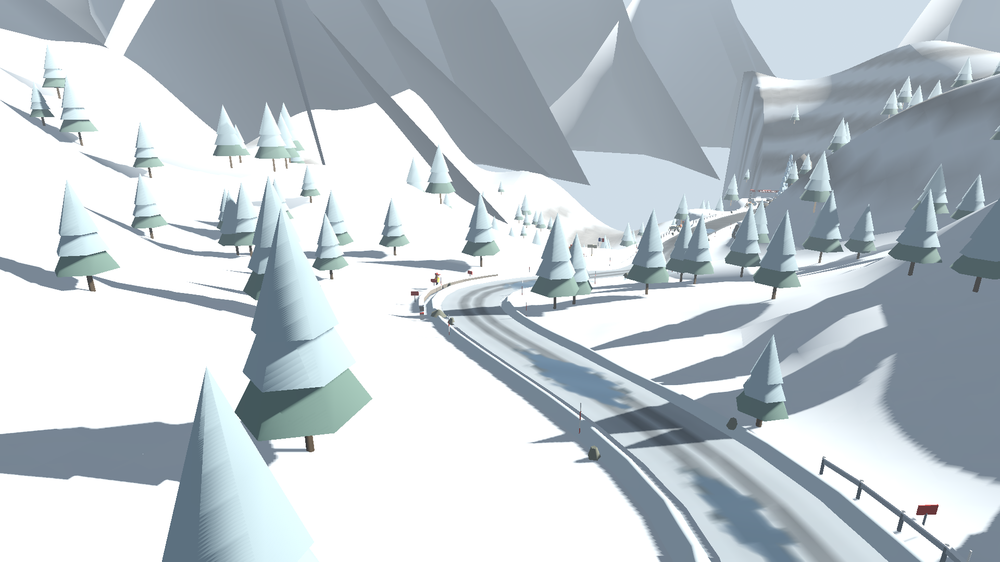
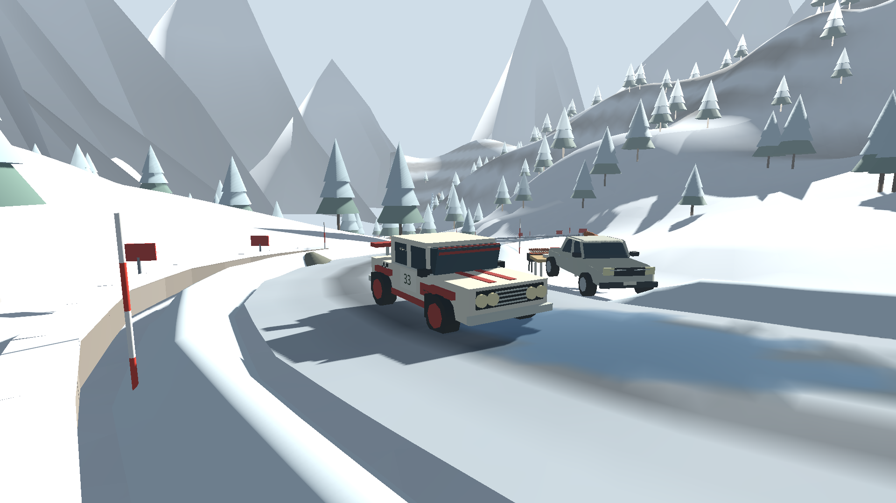
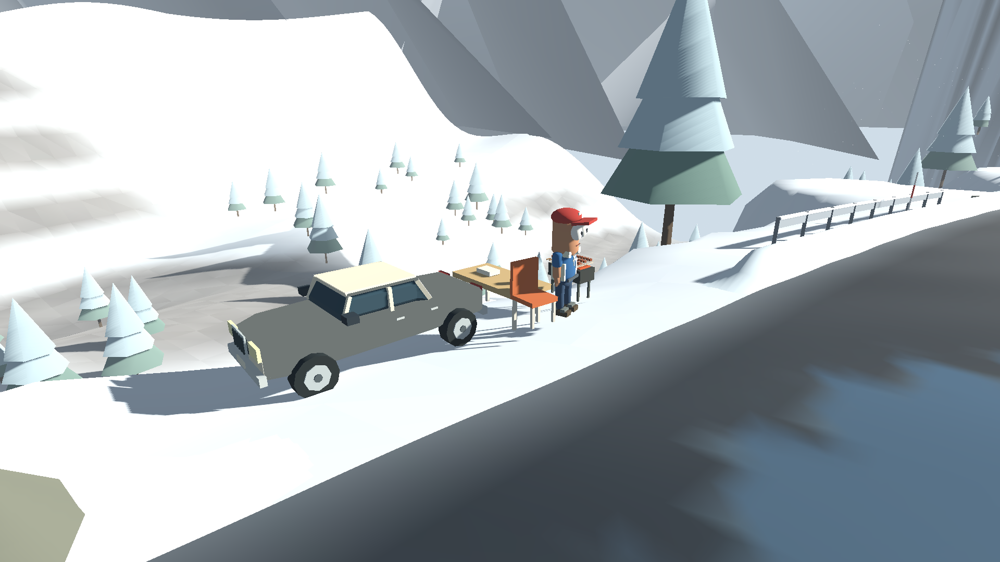
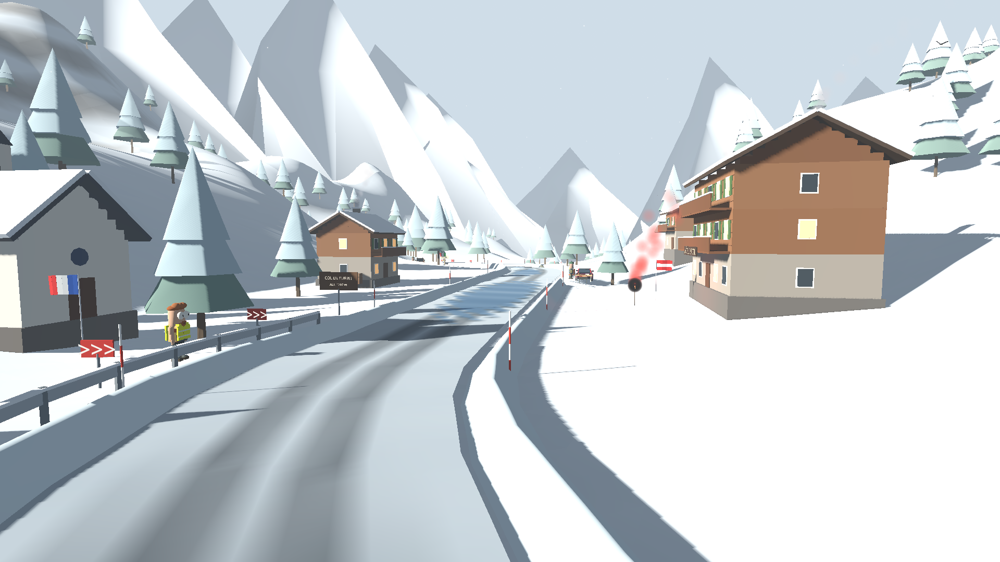
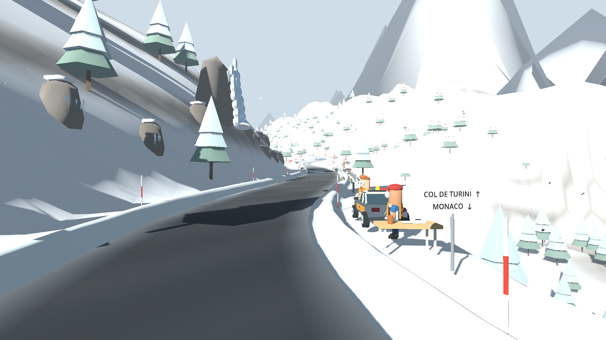

# Зимний Турини — игровые скриншоты

Снято из текущей игровой сцены Godot с её геометрией и освещением. Интерфейс скрыт; раллийная машина поставлена для кадра. Изображения не содержат рекламных наложений.











Все кадры — WebP, 1920 × 1080. Общий вид также используется в карточке зимнего СУ (480 × 240) и фоне меню (1280 × 720).

Для повторной съёмки из корня репозитория, с Godot 4.4.1 и доступным графическим дисплеем:

```sh
godot --path game --rendering-method gl_compatibility --audio-driver Dummy --script res://tools/export_winter_screenshots.gd
```

На Linux без дисплея можно запустить эту команду через `xvfb-run -a` с программным OpenGL. Скрипт включает дальнюю прорисовку для съёмки, не меняя пользовательскую настройку.
